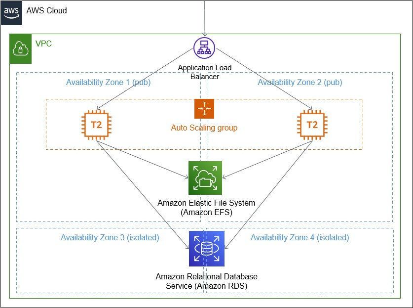

# WordPress behind LB. AWS course homework
## Solution diagram


## Project requirements
- node.js (tested on version v14.17.6)
- AWS Cloud Development Kit (tested on version 1.121.0)
- configured `~/.aws/config` and `~/.aws/credentials` or environment variables with programmatic access to AWS account you are interested in - `AWS_ACCESS_KEY_ID`, `AWS_SECRET_ACCESS_KEY` and `AWS_DEFAULT_REGION`
  
## Project deployment
``` bash
$ npm install -g aws-cdk
$ git clone https://github.com/schweppes2205/devopsSchoolAwsHomework.git
$ cd devopsSchoolAwsHomework

# Please change sshAccessKey varialbe in `bin\devops_school_aws_homework.ts` with an existing SSH access key name, otherwise deployment will be failed

$ npm install
$ npm run build
$ cdk deploy
```

## Project removal
``` bash
$ cdk destroy
```

## Project variables manipulations
You can change variables in file `bin\devops_school_aws_homework.ts`
- `awsReg` AWS desired regoin 
- `rdsPwdPlTxtAwsHw` MySQL instance admin password

## Misc information to keep in mind
- to login use `http://ALB_URL/wp-login.php`
- wordpress admin user is `root`, password is `pass`
- db admin password stores in plain-text. Plese keep in mind that Secrets should be used instead.
- project deployment \ destroy preiod is about 15 minutes
- all instances are configured to be free-tier applied if the resource exists in free-tier mode.
- To generate CLoudFormation template only you can use the command below:
``` bash
$ cdk synth
```